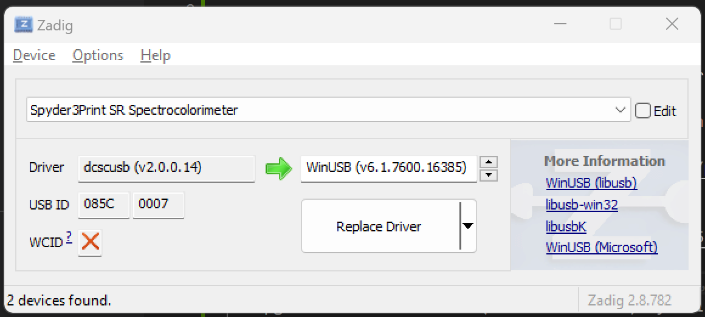
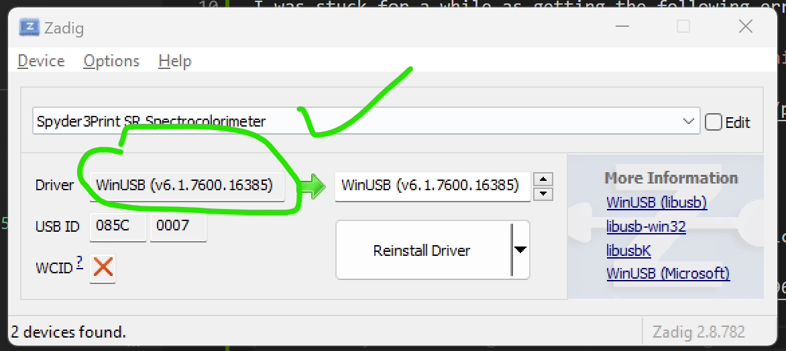
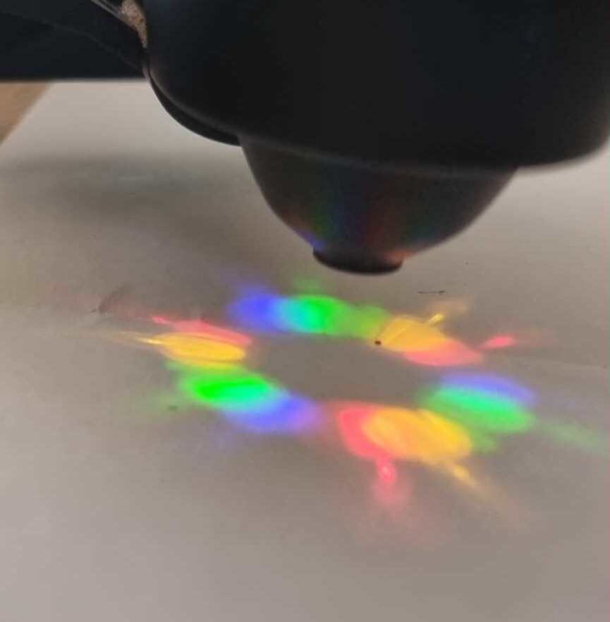
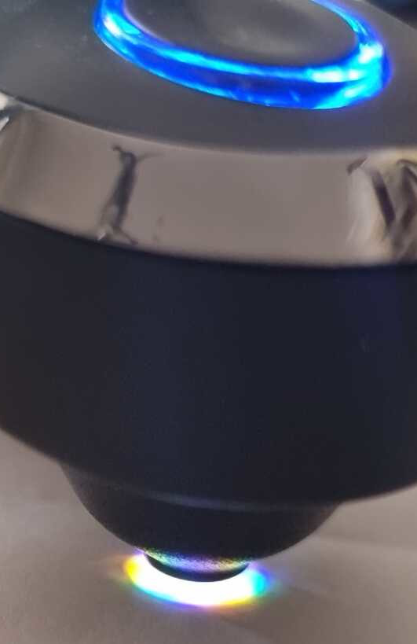
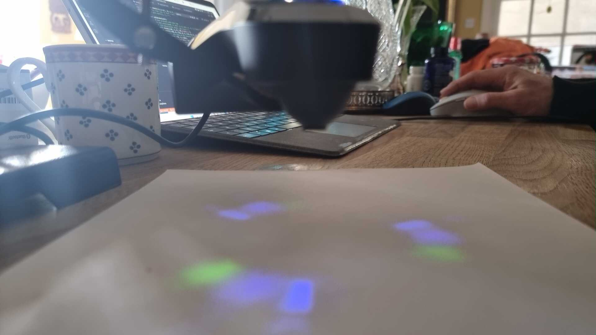
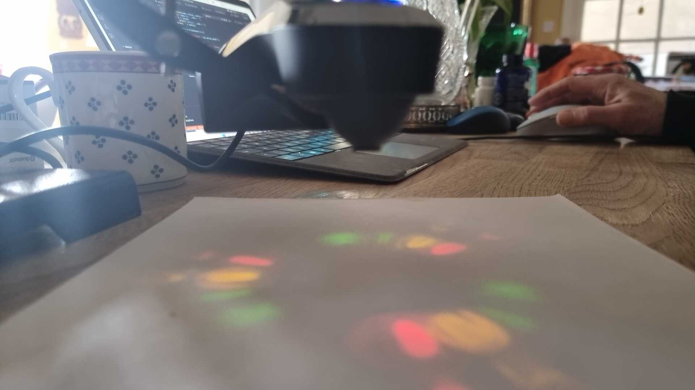
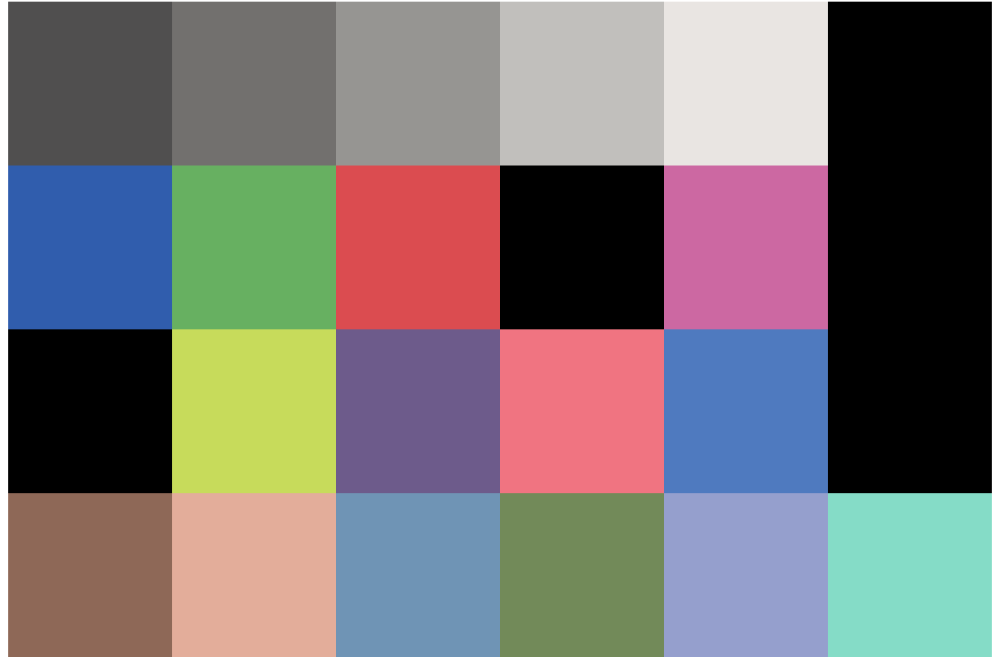

# pydatacolor
Using Python to connect to Datacolor Spyder Print spectrocolorimeter, SpyderPRINT™

I have made contact but now need to start reading from it.

Note this is version 7 and this https://github.com/drummonds/datacolor1005/blob/master/spectro.c was version 3

# Windows installation
I was stuck for a while as getting the following error

`NotImplementedError: Operation not supported or unimplemented on this platform`

 but then came across this post https://github.com/pyusb/pyusb/discussions/419 and used [Zadig](https://zadig.akeo.ie) to install libusb.

 Option list devices showed dcscusb (v2.0.0.14)
 I upgraded this to WinUSB (v6.1.7600.16385) by click replace driver button.
 
   

 so now I have:

   

This has broken SpyderPrint which only works with its own driver.

My code didn't work return pipe errors but unplugging and replugging got my test code test1.py to work.

I think there is a 16 character buffer on reading.  If you don't read all the data then this buffer wil fill up and if it gets to the limit a USB Pipe error is created.

Thre is still a lot of magic in this see test3.py.

Commands:
- 00x
- 01x
- 02x
- 03x
- 04x
- 05x
- 06x: Get serial number
- 07x
- 08x
- 09x
- 0Ax  Measure > val
- 0Bx
- 0Cx  Calibrate?
- 0Dx
- 0Ex
- 0Fx

Protocol
Ints are return unsigned in network big endian

Uses Bulk 
Bulk out = n Chars
Char 0 is command
Bulk In 
Char 0 echos command
Char 1 is number of bytes returned

## Led illumination

The [Northlight review](https://www.northlight-images.co.uk/spyder3print-sr-spyderprint-review/) has a great image of the [LEDs on paper](https://www.northlight-images.co.uk/content_images_2/spyder3print_sr/sensor-light.jpg).

This encouraged me and I have tried to get an image. I installed ip webcam on my phone and used testcam.py to get delayed images. By adjuting the delay I can get pictures as the LEDS light up. With a bit of random trial and error I got this:

If you have the paper closer the individual LEDS overlap it looks like white light:

The squencing can be seen here:
 

The Spyder uses 6 LED's of different colours to make measurements:
- Red
- Orange
- Green 1
- Green 2
- Blue 1
- Blue 2

During the calibration it measures each one individually.  During the measurment run it appears to use them one after another.  The persistence in the human eye seems longer than that of the WebCam exposure but it must be done each measurment in about 10 milliseconds.

## Nearing success

Here is my first SpyderCheckr.  It is not very good and shows clipping probles.

I am using the raw LAB data from the Printer.  It shows that that calibration must be done in the host software.  The data was hand crafted into a checkr forat as sRGB.  Becuase the calibration is off you can see clipping and some of the colours are out of SRGB gamut.

However that it is a solveable problem!

